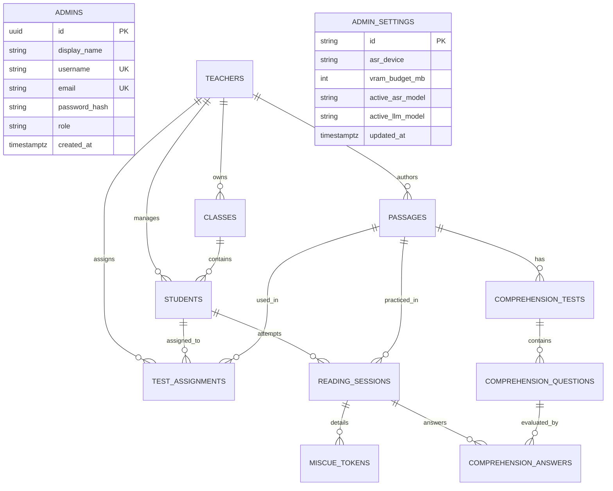

# ReadBuddy — Database Schema Specification (PostgreSQL)

Production-grade PostgreSQL database schema for **ReadBuddy** — an AI-powered reading comprehension assistant for basic education students at St. Michael's College of Caraga (SMCC), Butuan City / Nasipit.

> **Privacy & Offline Architecture Rule (R-6)**: Raw audio is strictly processed in-memory via local CTC/ASR models on GPU (`facebook/mms-1b-all` / MMS) and is **never** stored permanently in the database. Only derived metrics, phoneme/miscue tokens, and Phil-IRI assessment scores are recorded.

---

## 🗺️ Entity Relationship Diagram

---

## 🗄️ Database Tables Specification

### 1. `admins`
System administrator accounts for institutional governance, educator verification, and GPU server monitoring.

| Column | Type | Constraints | Description |
|---|---|---|---|
| `id` | `uuid` | `PRIMARY KEY` | Default `gen_random_uuid()` |
| `display_name` | `varchar(255)` | `NOT NULL` | Full administrator name |
| `username` | `varchar(100)` | `UNIQUE, NOT NULL` | Login username (e.g. `"admin"`) |
| `email` | `varchar(255)` | `UNIQUE, NOT NULL` | Institutional administrative email |
| `password_hash` | `varchar(255)` | `NOT NULL` | Direct `bcrypt` cryptographic hash |
| `role` | `varchar(50)` | `DEFAULT 'admin'` | RBAC role tag |
| `created_at` | `timestamptz` | `DEFAULT now()` | Timestamp of account creation |

---

### 2. `teachers`
Institutional educator accounts managing classes, student rosters, custom passages, and test assignments.

| Column | Type | Constraints | Description |
|---|---|---|---|
| `id` | `uuid` | `PRIMARY KEY` | Default `gen_random_uuid()` |
| `display_name` | `varchar(255)` | `NOT NULL` | Educator name (e.g. `"Prof. Maria Santos"`) |
| `school_id` | `varchar(100)` | `UNIQUE, NOT NULL` | School ID Number (e.g. `"2024001"`) |
| `email` | `varchar(255)` | `UNIQUE, NOT NULL` | Institutional email (e.g. `"teacher@smccnasipit.edu.ph"`) |
| `password_hash` | `varchar(255)` | `NOT NULL` | Direct `bcrypt` cryptographic hash |
| `role` | `varchar(50)` | `DEFAULT 'teacher'` | RBAC role tag |
| `admin_approved` | `boolean` | `DEFAULT false` | Security gate: must be approved by SMCC Admin before login |
| `email_verified` | `boolean` | `DEFAULT false` | Email verification flag |
| `email_verification_token` | `varchar(255)` | `NULLABLE` | One-time token sent via SMTP |
| `password_reset_token` | `varchar(255)` | `NULLABLE` | 6-digit verification code for password reset |
| `password_reset_expires_at`| `timestamptz` | `NULLABLE` | Reset code expiration timestamp |
| `created_at` | `timestamptz` | `DEFAULT now()` | Timestamp of registration request |

---

### 3. `classes`
Class sections created by teachers to organize students by grade level and section code.

| Column | Type | Constraints | Description |
|---|---|---|---|
| `id` | `uuid` | `PRIMARY KEY` | Default `gen_random_uuid()` |
| `teacher_id` | `uuid` | `FK → teachers(id), NOT NULL` | Owning educator |
| `name` | `varchar(150)` | `NOT NULL` | Section name (e.g. `"St. Jude"`, `"St. Mark"`) |
| `grade_level` | `smallint` | `NOT NULL, CHECK (0-12)` | Academic grade level (Grades 1–12) |
| `class_code` | `varchar(100)` | `UNIQUE, NOT NULL` | Unique section join code (e.g. `"SMCC-G7-STJUDE"`) |
| `created_at` | `timestamptz` | `DEFAULT now()` | Creation timestamp |

---

### 4. `students`
Student practice and assessment accounts enrolled under a teacher and class section.

| Column | Type | Constraints | Description |
|---|---|---|---|
| `id` | `uuid` | `PRIMARY KEY` | Default `gen_random_uuid()` |
| `display_name` | `varchar(255)` | `NOT NULL` | Student full name (e.g. `"Juan dela Cruz"`) |
| `school_id` | `varchar(100)` | `UNIQUE, NOT NULL` | Institutional Student ID (e.g. `"20261001"`) |
| `username` | `varchar(100)` | `UNIQUE, NOT NULL` | Student username (e.g. `"juan_delacruz"`) |
| `email` | `varchar(255)` | `NULLABLE` | Student email address |
| `password_hash` | `varchar(255)` | `NOT NULL` | Direct `bcrypt` cryptographic hash |
| `role` | `varchar(50)` | `DEFAULT 'student'` | RBAC role tag |
| `teacher_id` | `uuid` | `FK → teachers(id), NULLABLE` | Assigned teacher |
| `class_id` | `uuid` | `FK → classes(id), NULLABLE` | Assigned class section |
| `section_name` | `varchar(150)` | `NULLABLE` | Display section name |
| `grade_level` | `smallint` | `DEFAULT 7, CHECK (0-12)` | Academic grade level |
| `preferred_language` | `varchar(10)` | `DEFAULT 'en'` | Default language preference (`"en"` or `"tl"`) |
| `password_reset_token` | `varchar(255)` | `NULLABLE` | 6-digit password reset token |
| `password_reset_expires_at`| `timestamptz` | `NULLABLE` | Token expiry timestamp |
| `created_at` | `timestamptz` | `DEFAULT now()` | Account creation timestamp |

---

### 5. `passages`
Reading passages authored by teachers, extracted via OCR/document upload, or entered directly for reading practice.

| Column | Type | Constraints | Description |
|---|---|---|---|
| `id` | `uuid` | `PRIMARY KEY` | Default `gen_random_uuid()` |
| `teacher_id` | `uuid` | `FK → teachers(id), NULLABLE` | Creator teacher |
| `student_id` | `uuid` | `FK → students(id), NULLABLE` | Creator student (for self-directed practice) |
| `title` | `varchar(255)` | `NULLABLE` | Passage title |
| `source_type` | `varchar(50)` | `DEFAULT 'typed'` | `"typed"`, `"photo_ocr"`, or `"document_upload"` |
| `source_language` | `varchar(10)` | `DEFAULT 'en'` | `"en"` (English) or `"tl"` (Tagalog) |
| `raw_extracted_text`| `text` | `NULLABLE` | Raw output before student/teacher review |
| `confirmed_text` | `text` | `NOT NULL` | Final verified text scored against in ASR |
| `word_count` | `integer` | `DEFAULT 0` | Total word count derived from `confirmed_text` |
| `is_published` | `boolean` | `DEFAULT true` | Availability flag for students |
| `created_at` | `timestamptz` | `DEFAULT now()` | Creation timestamp |

---

### 6. `reading_sessions`
Completed or in-progress guided reading assessment attempts combining acoustic ASR tracking and Phil-IRI comprehension scoring.

| Column | Type | Constraints | Description |
|---|---|---|---|
| `id` | `uuid` | `PRIMARY KEY` | Default `gen_random_uuid()` |
| `student_id` | `uuid` | `FK → students(id), NOT NULL` | Student who completed the session |
| `passage_id` | `uuid` | `FK → passages(id), NULLABLE` | Read passage reference |
| `passage_preview` | `varchar(255)` | `NULLABLE` | Snippet for quick dashboard display |
| `source_language` | `varchar(10)` | `DEFAULT 'en'` | Language used (`"en"` / `"tl"`) |
| `started_at` | `timestamptz` | `DEFAULT now()` | Reading start timestamp |
| `finished_reading_at` | `timestamptz`| `NULLABLE` | Timestamp when student stopped reading aloud |
| `word_recognition_score` | `numeric(5,2)` | `DEFAULT 0.0` | % accuracy from real-time CTC miscue tokens |
| `comprehension_score` | `numeric(5,2)` | `DEFAULT 0.0` | % score from comprehension questions |
| `phil_iri_level` | `varchar(50)` | `DEFAULT 'instructional'` | DepEd Phil-IRI rating: `"independent"`, `"instructional"`, or `"frustration"` |
| `guidance_message` | `text` | `NULLABLE` | Pedagogical advice displayed on results screen |
| `completed_at` | `timestamptz` | `NULLABLE` | Final completion timestamp |
| `created_at` | `timestamptz` | `DEFAULT now()` | Audit timestamp |

---

### 7. `miscue_tokens`
Per-word acoustic ASR analysis audit trail for each oral reading session.

| Column | Type | Constraints | Description |
|---|---|---|---|
| `id` | `uuid` | `PRIMARY KEY` | Default `gen_random_uuid()` |
| `reading_session_id` | `uuid` | `FK → reading_sessions(id) ON DELETE CASCADE, NOT NULL` | Associated session |
| `word_index` | `integer` | `NOT NULL` | Position index of word within the passage |
| `expected_word` | `varchar(255)`| `NOT NULL` | Word from passage ground truth |
| `asr_transcribed_word`| `varchar(255)`| `NULLABLE` | Word transcribed by local CTC model |
| `asr_model_used` | `varchar(100)`| `DEFAULT 'facebook/mms-1b-all'` | CTC model identifier |
| `is_correct` | `boolean` | `DEFAULT true` | True if pronounced accurately |
| `confidence_score` | `numeric(5,4)`| `NULLABLE` | Raw CTC confidence value |

---

### 8. `comprehension_tests`
Comprehension tests generated locally via Gemma-3 4B / SeaLLMs or authored manually.

| Column | Type | Constraints | Description |
|---|---|---|---|
| `id` | `uuid` | `PRIMARY KEY` | Default `gen_random_uuid()` |
| `passage_id` | `uuid` | `FK → passages(id), NULLABLE` | Associated passage |
| `reading_session_id` | `uuid` | `FK → reading_sessions(id), NULLABLE` | One-off generated test for a session |
| `generated_by_model` | `varchar(100)`| `DEFAULT 'gemma3:4b'` | Local Ollama/LLM model identifier |
| `created_at` | `timestamptz` | `DEFAULT now()` | Generation timestamp |

---

### 9. `comprehension_questions`
Multiple-choice questions categorized strictly under DepEd Phil-IRI cognitive dimensions (Recall, Inference, Application).

| Column | Type | Constraints | Description |
|---|---|---|---|
| `id` | `uuid` | `PRIMARY KEY` | Default `gen_random_uuid()` |
| `test_id` | `uuid` | `FK → comprehension_tests(id) ON DELETE CASCADE, NOT NULL` | Parent test |
| `question_text` | `text` | `NOT NULL` | Question prompt |
| `question_type` | `varchar(50)` | `NOT NULL` | `"recall"` (Literal), `"inference"` (Inferential), or `"application"` (Critical/Applied) |
| `choices` | `text / jsonb` | `NOT NULL` | JSON array of 4 option strings |
| `correct_choice_index` | `smallint` | `DEFAULT 0, CHECK (0-3)` | 0-indexed correct option |
| `order_index` | `smallint` | `DEFAULT 0` | Display sequence order |

---

### 10. `comprehension_answers`
Student responses to comprehension questions during an assessment session.

| Column | Type | Constraints | Description |
|---|---|---|---|
| `id` | `uuid` | `PRIMARY KEY` | Default `gen_random_uuid()` |
| `reading_session_id` | `uuid` | `FK → reading_sessions(id) ON DELETE CASCADE, NULLABLE` | Reading session |
| `question_id` | `uuid` | `FK → comprehension_questions(id), NOT NULL` | Question answered |
| `selected_choice_index` | `smallint` | `NOT NULL` | Chosen option index (0–3) |
| `is_correct` | `boolean` | `NOT NULL` | True if selected index matches correct index |
| `answered_at` | `timestamptz` | `DEFAULT now()` | Timestamp of answer |

---

### 11. `test_assignments`
Reading assessment tests assigned by teachers to students with grading and audio review support.

| Column | Type | Constraints | Description |
|---|---|---|---|
| `id` | `uuid` | `PRIMARY KEY` | Default `gen_random_uuid()` |
| `passage_id` | `uuid` | `FK → passages(id), NOT NULL` | Assigned reading passage |
| `teacher_id` | `uuid` | `FK → teachers(id), NOT NULL` | Assigning educator |
| `student_id` | `uuid` | `FK → students(id), NOT NULL` | Assigned student |
| `status` | `varchar(50)` | `DEFAULT 'pending'` | `"pending"`, `"completed"`, or `"graded"` |
| `word_recognition_score` | `numeric(5,2)`| `NULLABLE` | Student word accuracy percentage |
| `comprehension_score` | `numeric(5,2)`| `NULLABLE` | Student comprehension percentage |
| `phil_iri_level` | `varchar(50)` | `NULLABLE` | Overall Phil-IRI proficiency tier |
| `teacher_remarks` | `text` | `NULLABLE` | Qualitative feedback from teacher |
| `audio_recording_url` | `varchar(500)`| `NULLABLE` | Optional session audio recording URL |
| `assigned_at` | `timestamptz` | `DEFAULT now()` | Date test was assigned |
| `completed_at` | `timestamptz` | `NULLABLE` | Date student finished the test |
| `graded_at` | `timestamptz` | `NULLABLE` | Date teacher finalized grading |

---

### 12. `admin_settings`
System-wide GPU resource allocation and model configurations.

| Column | Type | Constraints | Description |
|---|---|---|---|
| `id` | `varchar(50)` | `PRIMARY KEY` | Default `"default"` |
| `asr_device` | `varchar(50)` | `DEFAULT 'cuda'` | Hardware execution device (`"cuda"` / `"cpu"`) |
| `vram_budget_mb` | `integer` | `DEFAULT 8192` | VRAM ceiling allocation (e.g. 8192 MB) |
| `active_asr_model` | `varchar(150)`| `DEFAULT 'facebook/mms-1b-all'` | Active speech recognition model |
| `active_llm_model` | `varchar(150)`| `DEFAULT 'gemma3:4b'` | Active Ollama comprehension model |
| `updated_at` | `timestamptz` | `DEFAULT now()` | Timestamp of last setting modification |

---

## ⚡ Indexing Strategy

1. **`students(school_id)`** & **`teachers(school_id)`**: B-tree index for rapid O(1) authentication and duplicate rejection.
2. **`students(teacher_id, class_id)`**: Composite index for instant teacher class roster rendering.
3. **`reading_sessions(student_id, completed_at DESC)`**: Composite index for fast chronological student progress reporting.
4. **`miscue_tokens(reading_session_id, word_index ASC)`**: Ordered index for reconstructing passage highlighting during results analysis.
5. **`test_assignments(teacher_id, status)`**: Composite index for teacher grading queue filtering.
6. **`passages(teacher_id, created_at DESC)`**: Index for teacher passage library browsing.
